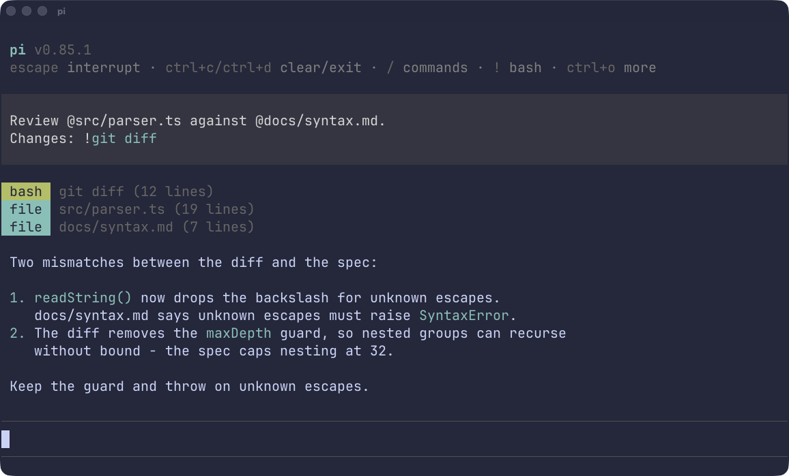

# pi-resolve

Give [Pi](https://pi.dev) instant context from files and shell commands.



Pi receives the files and command output before the agent responds, saving the time and
token overhead of extra tool calls. Your prompt stays unchanged, with file and
command status shown in Pi's UI.

## Dynamic project context

With pi-resolve, `AGENTS.md` can reference source documents and generate context
with shell commands.

- **Less maintenance:** update source documents, not copies in your instructions.
  Generate indexes instead of maintaining them by hand.
- **Less waiting:** context is ready before the agent starts, without extra read
  or shell tool calls.
- **Less token overhead:** skip the requests and tool-call exchanges needed to
  collect that context.

```markdown
Architecture: @docs/architecture.md
Coding conventions: @docs/conventions.md

Active guides:
!`find docs -type f -name '*.md' -exec env DOC={} yq -f extract 'select(.status == "active") | [strenv(DOC), .description] | @tsv' {} \;`
```

Here, Pi receives the contents of the architecture and conventions files and a
guide index that includes only paths and descriptions for active guides
(requires [yq](https://github.com/mikefarah/yq)).

References also work in **skills and prompt templates**. Other extensions can opt
in through the [shared resolver](#extension-integration).

## Install

```bash
pi install npm:pi-resolve
```

Start a new Pi session after installing.

## Usage

Resolution is single-level: references inside imported files or command output
remain text. A command that lists filenames does not attach those files.

### Files

Use `@path/to/file` to attach a file, or several files in the same prompt:

```text
Check @src/parser.ts against @docs/style.md.
```

The name after `@` must contain a **dot or slash**, not necessarily a file
extension. `@README.md`, `@.gitignore`, and `@src/README` all work. Use
`@./LICENSE` for a root-level extensionless file. Bare words such as `@LICENSE`
and `@alice` are ignored to avoid treating mentions and tags as files.

Paths are relative to the project working directory. Absolute paths and `~/`
paths also work. Escape spaces or brackets in filenames, for example
`@./My\ Notes.md` or `@./a\(b\).txt`. Without escaping, whitespace, quotes,
commas, semicolons, and brackets end a path.

### Directories

Use `@tests/` to give Pi a listing of that directory, for example:

```text
Directory listing (immediate entries):
.gitkeep
fixtures/
parser.test.ts
```

Only entry names are included, not file contents or nested listings. Entries are
sorted, hidden entries are included, and subdirectories end in `/`. Empty
directories are labeled `(empty directory)`.

### Commands

Wrap a shell command in `` !`…` `` to attach its standard output:

```text
Review my changes: !`git diff`
```

Commands run through `sh -c` in the project working directory, before the agent
responds. The next unescaped backtick ends the expression. Escape a backtick
inside the command with a backslash; shell escapes are passed to `sh` unchanged.
Prefer `$(...)` for shell substitutions.

**Commands run with your user permissions.** Only use commands and project
instructions you trust. Output limits do not undo command effects: a command
can modify files or contact services even if its output is too large to include.

### Literal references

Inline code and fenced code blocks suppress resolution. Use double backticks to
wrap a command expression: ```` `` !`git diff` `` ````.

A leading backslash also keeps a reference literal: `\@file.md` or
`` \!`git diff` ``. Backslashes pair off: an odd run escapes the marker;
an even run does not.

### Supported inputs

| Source | Setting | Files | Commands | UI feedback |
|---|---|:---:|:---:|---|
| Direct prompts | `userInput` | Yes | Yes | All |
| Prompt templates | `template` | Yes | No | All |
| System prompt, including `AGENTS.md` | `systemPrompt` | Yes | Yes | Hidden |
| Skill commands | `skill` | Yes | No | Hidden |

These are configurable defaults. Files include directory listings.

Prompts and templates resolve each turn. System context resolves on the first
turn of the session, not continuously.

Skill references resolve after argument substitution, with file paths relative
to the skill directory. Commands still run
in the project directory. References you type as arguments keep direct-prompt
settings and paths.

Other extensions must opt into the shared resolver below. Arbitrary tool inputs
and outputs are not automatically resolved.

## Settings

Settings are optional and loaded at session start:

- Global: `~/.pi/agent/pi-resolve.json` (or in Pi's configured agent directory).
- Project: `.pi/pi-resolve.json` in the working directory.

For example, enable template commands and show system-context feedback in Pi:

```json
{
  "sources": {
    "template": { "commands": true },
    "systemPrompt": { "display": "always" }
  },
  "limits": {
    "maxFileBytes": 100000,
    "maxCommandBytes": 100000,
    "maxTotalBytes": 1000000,
    "commandTimeoutMs": 10000
  }
}
```

Each entry in `sources`, or the shared `defaults` object, accepts:

| Setting | Meaning |
|---|---|
| `files` | Attach file contents and directory listings. |
| `commands` | Run command references and include their output. |
| `display` | Show file/command status rows in Pi's conversation UI: `"always"`, `"errors"` (errors and skipped items only), or `"never"`. |

UI feedback includes the path or command, line count, and any error. Hiding it
with `display` does not remove content sent to the model, including notices for
failed or oversized imports. Set both `files` and `commands` to `false` to disable
a source.

Omitted values keep the defaults shown above. Project settings override global
settings per field; source-specific settings override `defaults` from either
file. Invalid settings are ignored with a warning. Use plain JSON without
comments or trailing commas, and start a new session after changes. Project
settings are trusted: they can re-enable commands disabled in global settings.

### Limits

| Setting | Default | Applies to |
|---|---:|---|
| `maxFileBytes` | 100,000 bytes | Each file or directory listing. |
| `maxCommandBytes` | 100,000 bytes | Combined stdout/stderr for each command. |
| `maxTotalBytes` | 1,000,000 bytes | Imported context per turn or shared request, including wrappers and cached system output. |
| `commandTimeoutMs` | 10,000 ms | Execution time for each command, including shared-resolver calls. |

Byte limits are positive integers and do not cap your prompt or history.
`commandTimeoutMs` accepts integers from 1 to 2,147,483,647 milliseconds. Timed-out
commands are terminated; partial output is not attached.

Imports that exceed the total budget are omitted, not cut off. Direct input takes
priority, then system context, then templates or skills. Directory listings can
truncate at their per-file limit or 1,000 entries, with an omitted-entry count.

## Extension integration

System-prompt references added by another extension are resolved only if its
hook runs before pi-resolve's. Use the shared resolver below to avoid relying on
hook order.

Extension commands bypass Pi's input hooks. To resolve their references, emit
`pi-resolve:resolve` with `{ version: 1, text, baseDir, mode? }`. pi-resolve sets
`request.response` to a promise containing:

- `context`: ordered strings ready to include in the model's context.
- `references`: results with `kind`, `reference`, source offset `index`, and
  `status` (`success`, `missing`, `oversized`, `disabled`, or `error`). Successful
  results include `context`; results may also include `resolvedPath` and `reason`.

`mode` is `"all"` or `"files"`. Shared calls use `sources.extension` (files enabled,
commands disabled by default); `"files"` mode can further restrict permissions,
never enable them. Commands run in `baseDir`. The caller attaches results and
owns the UI feedback.

Check that `request.response` exists before awaiting it: no response means the
resolver is unavailable. Check each result before using it, so a missing file or
failed command is reported rather than silently left out of the model's context.

## Development

From a checkout:

```bash
npm install
npm run typecheck
npm test
pi -e .
```

Pi loads TypeScript directly; there is no build step. Tests use Pi's faux provider
and isolated directories, with no external model calls or real credentials. The
suite includes a packed CLI smoke test and command-timeout checks.

[Changelog](CHANGELOG.md) · [MIT license](LICENSE)
